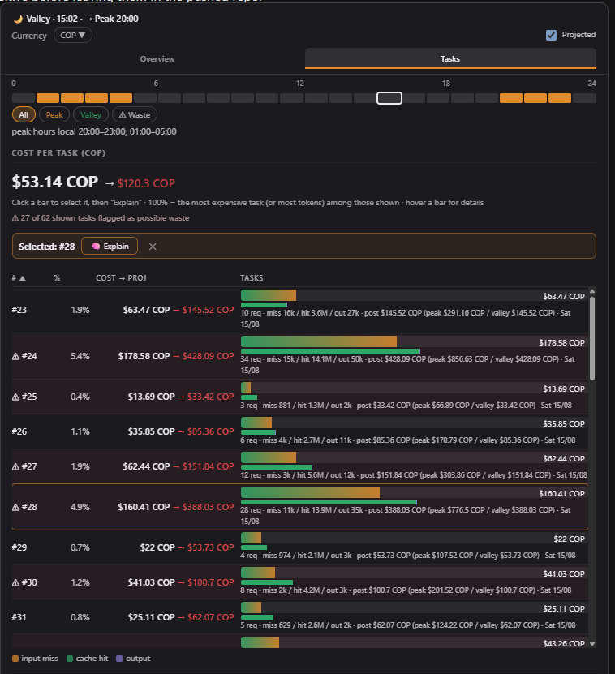

# dsh-token-anxiety

[](LICENSE)

The Token Anxiety widget, packaged as an installable out-of-tree bundle. A small
status widget sits in the band under the chat composer and shows, for the open
conversation:

- live peak/valley pricing status (DeepSeek pricing windows) plus local time
- current cost plus a **projected post-hike** figure (checkbox-controlled, shown
  in red; the view realigns to peak/valley-only once the new pricing takes effect)
- a per-task **cost table** with sortable columns (`#` / share %) and hover
  details + content previews
- an hour filter strip with peak/valley/waste presets and peak-accented cells
- a **currency manager**: COP / USD / CNY by default, add or remove any currency
  (flags + search), per-currency regional formatting (¥, €, £, ₩…), visible FX
  rates cached daily from a keyless API
- click-to-explain: a direct host route — no agent turn — that writes the
  analysis in the **conversation's language**
- **i18n**: full Chinese UI when the harness locale is `zh` (defaults to CNY)
- dark and light themes, following the harness's resolved theme

It survives restarts: it is composed through the profile, not loaded at runtime.

## Requirements

- DeepSeek Harness with a `web` profile (`dsh web`) — the bundle is composed
  through the profile's `dsh.profile.bundles` list.
- Node.js 22+ (the harness's own runtime; the bundle itself adds **zero
  dependencies** — node builtins only).

## Usage

- Hover or click the widget in the composer band to open the popup.
- **Overview** — headline cost (current, plus the projected post-hike figure in
  red when the **Projected** checkbox is on), tasks / requests / tokens, cost
  shape, waste snapshot, models, and the pricing table.
- **Tasks** — sortable per-task table (`#` or share %). Click a bar to select
  it and run **Explain**; hover a row for details. The hour strip filters by
  peak/valley hours or waste flags.
- **Currency** — pick any enabled currency (defaults COP / USD / CNY); open the
  chooser to see FX rates, add more (flags + search), or remove them.
- **Explain** — one small LLM call per task, written in the conversation's
  language.

## Screenshots

_Taken with the bundle running in the web profile — replace with your own._

| Dark | Light |
|---|---|
|  |  |
|  | |

## Security

See [SECURITY.md](SECURITY.md) for the full review. Summary: the three HTTP
routes are POST-only, cap request bodies, validate all input, and apply the same
browser-trust fence as the harness `/api` prefix (loopback/trustedHosts Host,
same-origin Origin, `sec-fetch-site`); the explain route has an anti-abuse
throttle; nothing is written to the session log; zero runtime dependencies.

## How it works

- `cordis.patch.yml` inserts one plugin row (`token-anxiety`) into the profile.
- The node half (`index.js`) registers the `tokenAnxiety` session projection: a
  pure fold over the ROOT session log that accumulates per-turn token usage,
  cost, tool signals and waste flags. No network, no model calls.
- The same node half registers `POST /token-anxiety/explain` on the harness
  webserver (`ctx.webServer`): the widget's Explain button fetch()es it and the
  handler runs the LLM analysis (the same pipeline the `explain_task` tool
  uses). Nothing is appended to the session log, so sessions stay loadable.
- `POST /token-anxiety/pricing-sync` (same trust fence) fetches the official
  DeepSeek pricing page, turns it into readable text, and sends it with a strict
  JSON schema to an LLM call — no layout scraping in code. The model returns
  CNY-per-1M prices (current, peak, valley), the Beijing peak windows and the
  effective date; the host validates, converts CNY→USD at a fixed 7.0 rate, and
  writes `pricing.override.json` next to the bundle with an explicit
  schema/currency/unit shape. A restart loads the override over the embedded
  defaults (the model list derives from the active pricing, so new models
  surface automatically), and the pricing-derived `stateVersion` discards stale
  projection caches.
- The browser half (`lib/client.js`) is a hand-written client bundle registered
  through `window.__ModuleLoader__.load({ id, factory })` — no bundler, no
  minification. It reads the projection with `useProjection('tokenAnxiety')`
  and computes peak/valley status, local time and the hour strip in the browser
  from the projection's embedded pricing config.

## Install

```sh
# from any directory; the path is absolute
dsh plugin --profile web add /path/to/dsh-token-anxiety
```

Then restart the web server (`dsh web` / however you launch it). A restart is
required because the bundle row and the client boot graph are composed at boot.

## Update after editing

The bundle is pnpm-linked into the profile, so editing files here is enough for
a HOST-half change; the client graph only picks up a changed bundle after a
restart. After changing files, restart the web server. To remove:

```sh
dsh plugin --profile web remove dsh-token-anxiety
```

## Configuration

### Currencies

Defaults are **COP / USD / CNY**. Add or remove currencies from the chooser
(any code in the ~40-currency catalog); the enabled list persists to
`pricing.override.json` via `POST /token-anxiety/currencies` (a restart loads
it). Rates are USD-base, refreshed by the pricing sync and cached for 24 h.

### Pricing

Prices are embedded in `PRICING` (`index.js`) as the fallback and can be
refreshed from the official DeepSeek pricing page:

```sh
curl -X POST http://127.0.0.1:3080/token-anxiety/pricing-sync -H "Content-Type: application/json" -d '{}'
```

The route fetches the page, asks a model to extract the current and peak/valley
rates (CNY → USD at a fixed 7.0 rate; the Beijing peak windows and the
effective date are parsed too) and writes `pricing.override.json`. FX rates
(`open.er-api.com`, keyless) ride along, cached daily. A restart merges the
override over the defaults; the pricing-derived `stateVersion` discards stale
projection caches.

### Language

When the harness locale is `zh`, the whole UI renders in Chinese and the
currency defaults to CNY. It follows the harness `locale.preference` setting.

## Known limitations

- **Root-session tasks only.** The projection fold is per-session and
  synchronous, so the subagent tree the old dynamic plugin aggregated on demand
  cannot be folded here. Subagent conversations do not appear in the widget. (The
  `explain_task` tool itself aggregates the full subagent tree, so its
  conversation context is complete.)
- **Explain is a direct host route, not an agent turn.** The widget's button
  fetch()es `/token-anxiety/explain` (registered by the host half on the
  harness webserver), and the host runs the analysis LLM call inline. The
  analysis lives in the widget's component state, so it does not survive a page
  reload and it is not part of the session log (deliberately: it never writes a
  custom session event, so sessions stay loadable). The `explain_task` tool is
  kept for conversational asks ("why did this cost so much?"). The route sits
  outside the harness `/api` prefix, so it applies the same browser-trust
  predicate itself (loopback or `trustedHosts` Host, same-origin Origin,
  `sec-fetch-site`); the deployment still binds loopback-only.
- **Pricing is embedded and dated.** The embedded `PRICING` is the fallback;
  refreshing it is a host-side action (`POST /token-anxiety/pricing-sync`, see
  [Configuration](#configuration)) that writes `pricing.override.json`; a
  restart merges it over the defaults. Editing `PRICING` by hand still works;
  `stateVersion` derives from the active pricing, so any change discards
  persisted projection-cache rows.

## Files

```
dsh-token-anxiety/
├── package.json            # dsh.bundle + dsh.client manifests, exports["./client"]
├── cordis.patch.yml        # one plugin row
├── index.js                # host half: projection fold + explain_task tool + /token-anxiety/explain + /token-anxiety/pricing-sync + /token-anxiety/currencies routes
├── lib/client.js           # browser half: the widget (hand-written bundle)
├── SECURITY.md             # security review
├── shots/                  # UI screenshots (dark/light, tabs, currency chooser)
└── LICENSE                 # MIT
```

> `pricing.override.json` is runtime state (gitignored): it stores the synced
> pricing, FX rates and the enabled-currency list.

## License

[MIT](LICENSE) © mov-eax-eax
