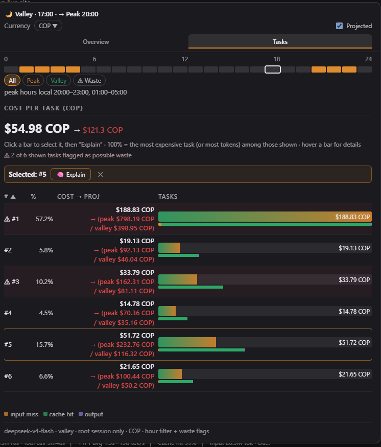
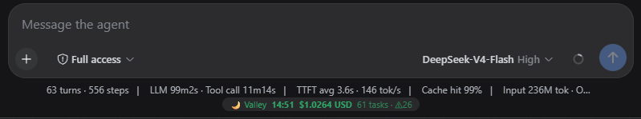
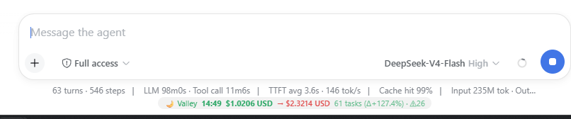
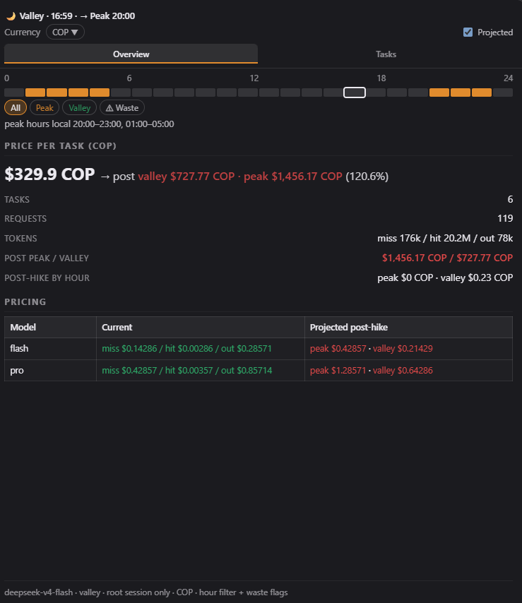
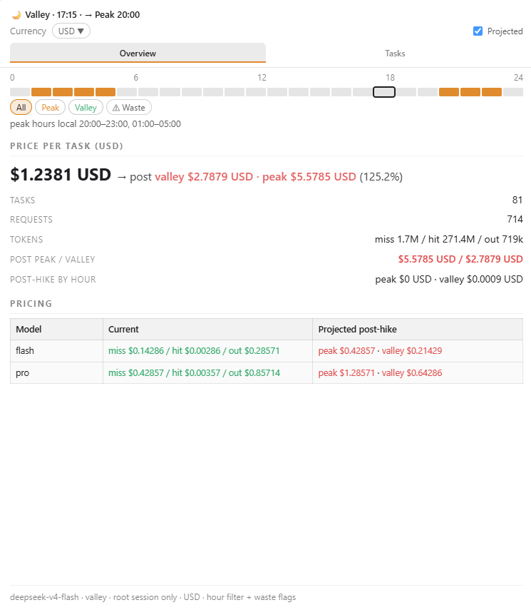
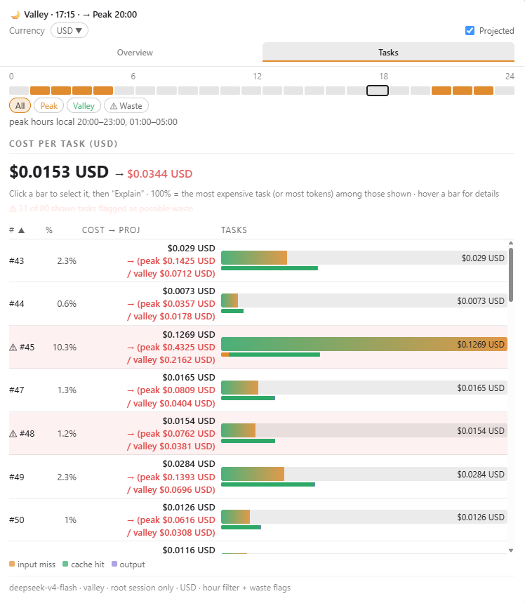
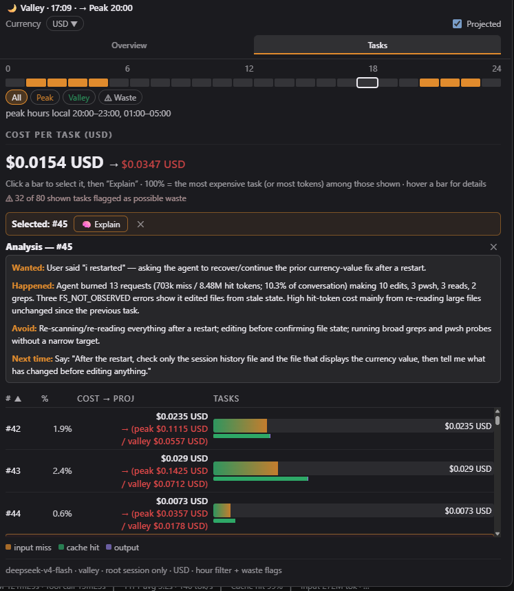
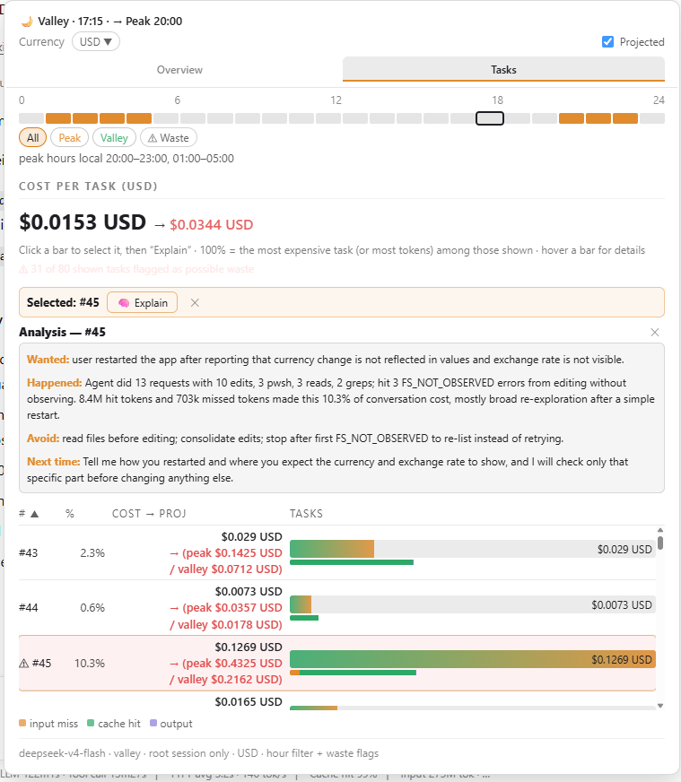

# dsh-token-anxiety

[English](README.md) | 中文

[](LICENSE)

Token Anxiety 小部件实时追踪对话中每个任务的成本。它运行在聊天输入框下方的栏位中，显示 DeepSeek 的定价状态（高峰/低谷）、每个任务的 token 用量与成本，并可一键分析 token 花在了哪里。以 bundle 形式安装，不引入任何额外依赖。

**安装**（从任意目录；路径为绝对路径）：

```sh
# 从 npm（已发布包）
dsh plugin --profile web add dsh-token-anxiety

# 或从本地检出
dsh plugin --profile web add /path/to/dsh-token-anxiety
```

然后重启 `dsh web` 并刷新页面即可。



- **实时定价状态** — 按你的时区显示高峰/低谷时段，并附带本地时间
- **成本概览** — 当前成本，以及涨价后的预测值（红色显示）
- **按任务明细** — 可排序的每任务成本表与 token 用量；悬停任意一行查看详情
- **货币支持** — 默认 COP / USD / CNY，另支持 40 余种货币的区域化格式（¥、€、£、₩…）与实时汇率
- **一键解释** — 以对话语言流式生成简短的成本分析
- **深色/浅色与英文/中文** — 跟随 harness 的主题与语言设置

以可安装的 bundle 形式打包（通过 profile 组合，重启后仍然保留）。

## 使用

- 悬停或点击 composer 栏中的小部件以打开弹窗。

  <table>
    <tr>
      <td></td>
      <td></td>
    </tr>
  </table>

- **概览** — 以大号数字突出显示对话总成本（当前值，以及勾选「预测」后红色显示的涨价后预测值），并展示任务数、请求数与 token 数，以及定价表：每个模型的当前价与预测价，其中预测的**高峰/低谷**值在低于当前价时显示为**绿色**，高于当前价时显示为**红色**。

  <table>
    <tr>
      <td></td>
      <td></td>
    </tr>
  </table>

- **任务** — 可排序的每任务成本表（按 `#` 或占比 %）。每行显示该任务的总成本；勾选「预测」后，成本列会以两行显示预测的**高峰/低谷**拆分。悬停任意一行可查看详情提示；点击条形选中任务并运行**解释**。

  

- **货币** — 选择任一已启用货币（默认 COP / USD / CNY）；打开选择器可查看汇率、添加更多货币（国旗 + 搜索）或移除货币。
- **解释** — 每个任务一次小型 LLM 调用；分析结果**流式呈现**，并使用**对话语言**书写（先以一次小型 LLM 调用检测该任务用户消息的 ISO 639-1 语言代码）。结果为约 60–100 词的简短报告，共四行标签 —— `Wanted:` / `Happened:` / `Avoid:` / `Next time:` —— 以粗体强调标签的富文本渲染。

  <table>
    <tr>
      <td></td>
      <td></td>
    </tr>
  </table>

## 安全

完整评审见 [SECURITY.md](SECURITY.md)。摘要：三个 HTTP 路由仅接受 POST，限制请求体大小，校验所有输入，并应用与 harness `/api` 前缀相同的浏览器信任围栏（loopback/trustedHosts Host、同源 Origin、`sec-fetch-site`）；解释路由带有防滥用限流与硬超时，模型卡死也不会阻塞路由；不会向会话日志写入任何内容；零运行时依赖。

## 工作原理

- `cordis.patch.yml` 向 profile 插入一行插件条目（`token-anxiety`）。
- Node 端（`index.js`）注册 `tokenAnxiety` 会话投影：对 ROOT 会话日志的纯折叠，累计每个任务的 token 用量、成本、工具信号与浪费标记。不访问网络，不调用模型。
- 同一 Node 端在 harness webserver（`ctx.webServer`）上注册 `POST /token-anxiety/explain`：小部件的「解释」按钮通过 fetch() 调用它，由 host 运行 LLM 分析。响应以 **NDJSON** 流式返回（`{"delta": …}` 行），小部件边生成边渲染；host 端 60s 超时会中止卡死的 LLM 流（client 端在 70s 中止并显示可见错误）。语言由一次小型 LLM 调用返回 ISO 639-1 代码判定。不会向会话日志追加任何内容，因此会话始终可加载。
- `POST /token-anxiety/pricing-sync`（同一信任围栏）抓取官方 DeepSeek 定价页面，转为可读文本，并配合严格的 JSON schema 交给一次 LLM 调用 —— 代码中不做布局抓取。模型返回 CNY/百万 token 的当前价、高峰/低谷价、北京高峰时段与生效日期；host 校验后以固定 7.0 汇率将 CNY 换算为 USD，并写入 bundle 旁的 `pricing.override.json`。重启后覆盖层合并到内置默认值之上（模型列表由当前定价派生，新模型会自动出现），且由定价派生的 `stateVersion` 会丢弃过期的投影缓存。
- 浏览器端（`lib/client.js`）是手工编写的 client bundle，通过 `window.__ModuleLoader__.load({ id, factory })` 注册 —— 无打包器、无压缩。它通过 `useProjection('tokenAnxiety')` 读取投影，并在浏览器中根据投影内置的定价配置计算高峰/低谷状态、本地时间与小时条。

## 安装

### 从 npm 安装（已发布包）

该包已发布到公共 npm registry：

```sh
npm view dsh-token-anxiety          # 验证：包名、版本 0.1.x、MIT
```

安装到 harness profile（该命令会将其加入 profile 的 `package.json` 依赖及其
`dsh.profile.bundles` 列表）：

```sh
dsh plugin --profile web add dsh-token-anxiety
```

或在任意 npm 项目中直接安装：

```sh
npm install dsh-token-anxiety
# 或锁定精确版本：
npm install dsh-token-anxiety@0.1.0
```

> 注意：要让 `dsh web` 加载小部件，**profile** 必须依赖该包并在
> `dsh.profile.bundles` 中列出它 —— `dsh plugin --profile web add
> dsh-token-anxiety` 会自动完成这两步。

### 从本地检出安装

```sh
# 从任意目录；路径为绝对路径
dsh plugin --profile web add /path/to/dsh-token-anxiety
```

### 无论哪种方式安装后

重启 web server（`dsh web` 或你习惯的启动方式）。必须重启，因为 bundle 行与 client 启动图在启动时组合。

## 编辑后更新

bundle 已 pnpm-link 到 profile 中，因此直接编辑本目录文件即可生效于 HOST 端；client 图只在重启后才会加载变更后的 bundle。修改文件后请重启 web server。移除：

```sh
dsh plugin --profile web remove dsh-token-anxiety
```

## 配置

### 货币

默认为 **COP / USD / CNY**。可从选择器添加或移除货币（约 40 种货币目录中的任意代码）；已启用列表通过 `POST /token-anxiety/currencies` 持久化到 `pricing.override.json`（重启后加载）。汇率以 USD 为基准，由定价同步刷新并缓存 24 小时。

### 定价

价格内置于 `PRICING`（`index.js`）作为默认值，可从官方 DeepSeek 定价页面刷新：

```sh
curl -X POST http://127.0.0.1:3080/token-anxiety/pricing-sync -H "Content-Type: application/json" -d '{}'
```

该路由抓取页面，让模型提取当前价与高峰/低谷价（CNY → USD 按固定 7.0 汇率；同时解析北京高峰时段与生效日期），并写入 `pricing.override.json`。FX 汇率（`open.er-api.com`，无密钥）随同步携带，按日缓存。重启后将覆盖层合并到默认值之上；由定价派生的 `stateVersion` 会丢弃过期的投影缓存。

### 语言

当 harness 语言设置为 `zh` 时，整个界面以中文渲染，默认货币为 CNY。跟随 harness 的 `locale.preference` 设置。

## 已知限制

- **仅 ROOT 会话任务。** 投影折叠按会话同步进行，因此旧动态插件按需聚合的子智能体树无法在此折叠。子智能体对话不会出现在小部件中。（`explain_task` 工具本身会聚合完整的子智能体树，因此其对话上下文是完整的。）
- **解释是直接 host 路由，而非智能体回合。** 小部件的按钮 fetch() `/token-anxiety/explain`（由 host 端在 harness webserver 上注册），host 内联运行分析 LLM 调用。分析存于小部件的组件状态，因此页面刷新后不会保留，也不属于会话日志（有意为之：它从不写入自定义会话事件，会话始终可加载）。`explain_task` 工具保留用于对话式提问（「为什么这个任务这么贵？」）。该路由位于 harness `/api` 前缀之外，因此自行应用相同的浏览器信任谓词（loopback 或 `trustedHosts` Host、同源 Origin、`sec-fetch-site`）；部署仍仅绑定 loopback。
- **定价内置且带日期。** 内置 `PRICING` 为默认值；刷新需在 host 端执行（`POST /token-anxiety/pricing-sync`，见[配置](#配置)），会写入 `pricing.override.json`；重启后合并到默认值之上。手工编辑 `PRICING` 仍然有效；`stateVersion` 由当前定价派生，任何变更都会丢弃持久化的投影缓存行。

## 文件

```
dsh-token-anxiety/
├── package.json            # dsh.bundle + dsh.client 清单，exports["./client"]
├── cordis.patch.yml        # 一行插件条目
├── index.js                # host 端：投影折叠 + explain_task 工具 + /token-anxiety/explain + /token-anxiety/pricing-sync + /token-anxiety/currencies 路由
├── lib/client.js           # 浏览器端：小部件（手写 bundle）
├── test/core.test.js       # 单元测试（npm test，node --test）
├── SECURITY.md             # 安全评审
├── shots/                  # UI 截图（聊天区域、概览、任务、解释 — 深色/浅色）
└── LICENSE                 # MIT
```

> `pricing.override.json` 是运行时状态（已 gitignore）：保存同步后的定价、FX 汇率与已启用货币列表。

## 许可

[MIT](LICENSE) © mov-eax-eax
